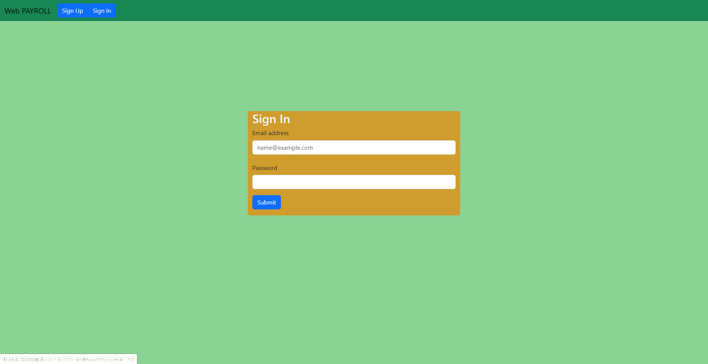
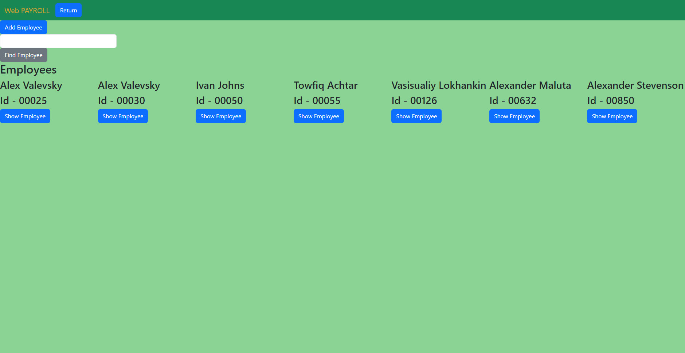
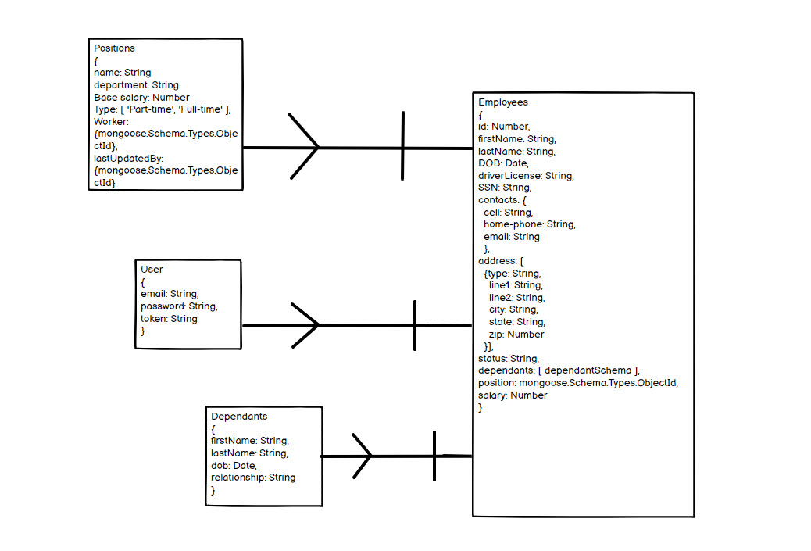

# **Project: Web PAYROLL CRUD application**

## Description: 
Web PAYROLL - application created for keeping track on created positions and companies' employees, calculating salary based on worked hours and salary. Also it allows to keep all information on employees at the app. 
The app allows users to create, read, update, delete employees information in the app stored in the DB. Also it allow to add, read, update and delete information about employee's dependants.

### Requests

| Entity       | Request     |Routes       |Purpose  |
| ------------ | ----------- |-------------|---------|
| EMPLOYEE     | POST        |'/employees' |Create new employee|
| EMPLOYEE     | GET         |'/employees' |Load all employees|            
| EMPLOYEE     | GET         |'/employees/:id'|Show card for one employee|
| EMPLOYEE     | PATCH       |'/employees/:id'|Update one specific employee|
| EMPLOYEE     | DELETE      |'/employees/:id'|Delete one specific employee|
| DEPENDANT    | POST        |'/dependants' |Add dependant record to an existing employee|
| DEPENDANT    | UPDATE      |'/dependants/:dependantId'|Update the dependant record|
| DEPENDANT    | DELETE      |'/dependants/:employeeId/:dependantId'|Delete the dependant record|
| USER         | POST        |'/sign-in'|Sign in to the application
| USER         | POST        |'/sign-up'|Create a user

## MVP/Version 1

### 1. User can sign up/log in to the app by inputting email and password.

&nbsp;  
 
### 2. User can navigate to a page with employees and see list of employees on the page.

&nbsp;  
### 3. User can add new employee.

&nbsp;  
### 4. User can update or delete existing employee.

&nbsp;  
### 5. User can add dependants to existing employee.

&nbsp;  
### 6. User can search existing employee by their database id.

## Technology Used

* JavaScript
* Express.js
* MongoDB
* HTML
* Bootstrap 5.3
* CSS

## ERD

### Models' relationship schema

 

## Next Steps

&nbsp;  

## Version 2

### 1. As an HR, I want to be able to navigate to main page where all open position load in. 
### 2. As an HR, I want to be able to Create a new open position.
### 3. As an HR, I want to be able to update any existing position.

&nbsp;

## Version 3

### 1. As an HR, I want to be able to log in employee's worked time.
### 2. As an Accountant, I want to be able to calculate employee's dalary based on worked time.
### 3. As an Accountant, I want to be able to calculate salary taxes and complete paystabs.
### 4. As an Accountant, I want to be able to send out paystabs to employee's emails.

